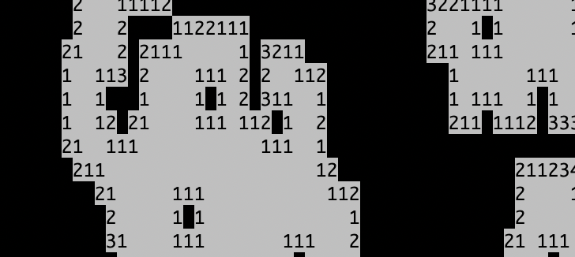

# Arcade

Python scripts to simulate interactive games

## Snake

The snake script simulates the 1976 version of the classic [Snake](https://en.wikipedia.org/wiki/Snake_(video_game_genre)) game. You increase in length as you eat more pieces of food. You don't want the snake to eat itself or bump into any walls. The script runs on Python 2.7.

## Minesweeper

The minesweeper script simulates the 1960s version of the classic [Minesweeper](https://en.wikipedia.org/wiki/Minesweeper_(video_game)) game. You need to flag all the bombs without clearing any squares with underlying bombs. The script runs on Python 3.7.
